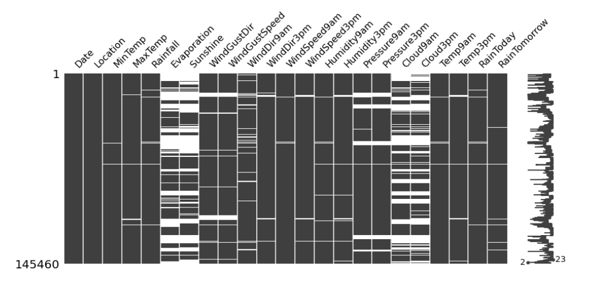
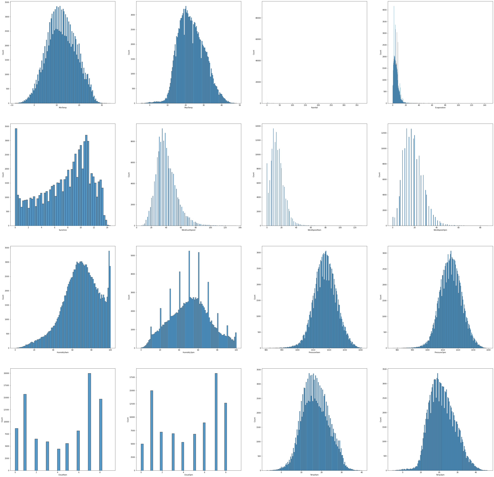
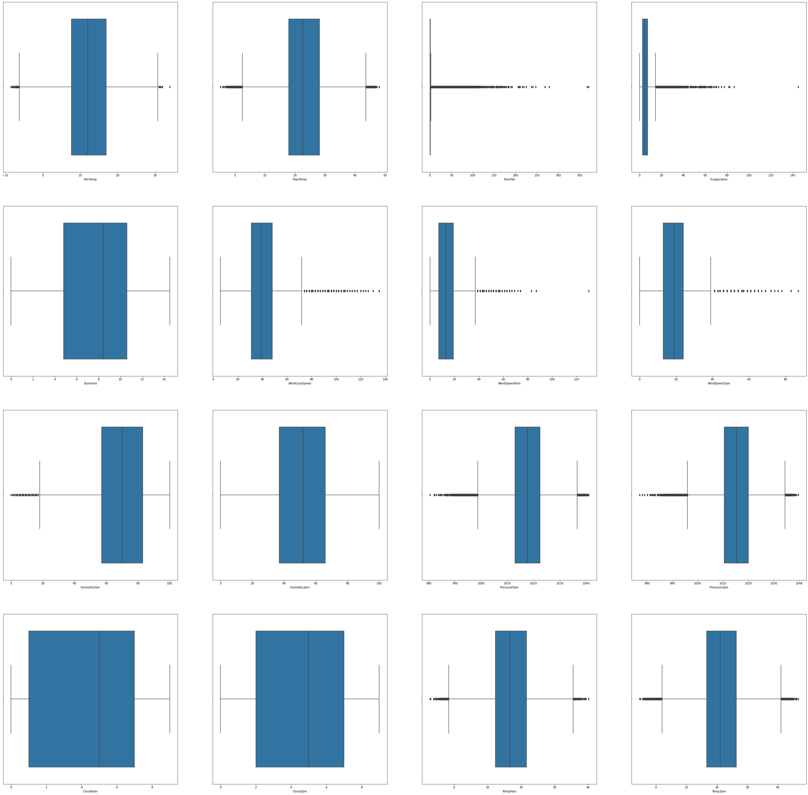

# Rain In Australia Prediction

In this we have to predict whether there will Rain tomorrow or not. This is a classification problem.

- [Dataset](https://www.kaggle.com/jsphyg/weather-dataset-rattle-package?select=weatherAUS.csv)
- [Kernel](https://www.kaggle.com/nadeem4nk/rain-in-australia-85-accuracy)

> > Dataset contain 10 years of daily weather observation from different location across Autralia. There are 23 columns and 145460 records.

## Feature Engineering or Data Preprocessing

- _For Numberical Feature:_ We have used Deterministic linear Regression to impute numerical features.
- _For Categorical Feature:_ We have used mode per location to impute missing value of that location. In case of Location with no categorical value, we have used the mode of complete column.

## Feature Selection

- We have used Lasso Regression and Pearson Correlation to select relevant features.
- Any independent feature with Zero Correlation with Dependent feature _(RainTomorrow)_ is dropped.
- Any independent feature with more than 0.9 value with other independent feature is dropped.

_Selected Features_

`['Rainfall', 'Sunshine', 'WindGustSpeed', 'WindSpeed9am', 'WindSpeed3pm','Humidity3pm', 'Pressure3pm', 'Cloud3pm', 'WindDir9am_ENE','WindDir9am_N', 'WindDir9am_NE', 'WindDir9am_NNE', 'WindDir9am_S','WindDir9am_SSW', 'WindDir3pm_N', 'WindDir3pm_NNE', 'WindDir3pm_NNW', 'WindDir3pm_NW', 'WindDir3pm_SSE', 'WindDir3pm_WNW', 'RainToday']`

## Model Selection and Cross Validation

- We have utilized stratifed K fold cross validation technique to compute the accuracy of model.
- stratifed K fold cross validation is used because of imbalance dataset and to ensure that train dataset contain equal number of records from each group.
- We are performing 10 experiments in Stratified K Fold Cross validation.

### Utlized Model

#### Logistic Regression

- _List of possible accuracy:_ `[0.8432558779045786, 0.8407809707135983, 0.841880929465145, 0.839543517118108, 0.8421559191530318, 0.8404372336037399, 0.8424309088409184, 0.8443558366561253, 0.8397497593840231, 0.8462807644713323]`
- _Maximum Accuracy That can be obtained from this model is:_ 84.62 %
- _Minimum Accuracy:_ 83.95 %
- _Overall Accuracy:_ 84.20 %
- _Standard Deviation is:_ 0.20 %

#### K Nearest Neighbours

- _List of possible accuracy:_ `[0.8269627388972913, 0.824487831706311, 0.8278564553829232, 0.8222879142032173, 0.8249003162381411, 0.8279939502268665, 0.8299188780420734, 0.8324625326550255, 0.8264815069434897, 0.8278564553829232]`
- _Maximum Accuracy That can be obtained from this model is:_ 83.24 %
- _Minimum Accuracy:_ 82.22 %
- _Overall Accuracy:_ 82.71 %
- _Standard Deviation is:_ 0.27 %

#### Descision Tree

- _List of possible accuracy:_ `[0.7709335899903753, 0.7775333424996562, 0.7762958889041661, 0.7737522342912141, 0.7706586003024887, 0.7735459920252991, 0.7769146157019112, 0.7717585590540355, 0.778220816719373, 0.7782895641413446]`
- _Maximum Accuracy That can be obtained from this model is:_ 77.82 %
- _Minimum Accuracy:_ 77.06 %
- _Overall Accuracy:_ 77.47 %
- _Standard Deviation is:_ 0.28 %

#### XGBoost

- _List of possible accuracy:_ `[0.8422246665750034, 0.8429808882166919, 0.8394060222741647, 0.8394747696961364, 0.8420184243090885, 0.8392685274302214, 0.8444933315000688, 0.841468444933315, 0.8404372336037399, 0.8437371098583804]`
- _Maximum Accuracy That can be obtained from this model is:_ 84.44 %
- _Minimum Accuracy:_ 83.92 %
- _Overall Accuracy:_ 84.15 %
- _Standard Deviation is:_ 0.17 %

### Naive Bayes Classifier.

- _List of possible accuracy:_ `[0.8101883679362024, 0.807300976213392, 0.8081259452770521, 0.8036573628488932, 0.8081259452770521, 0.8077822081671937, 0.8118383060635226, 0.8107383473119758, 0.8129382648150695, 0.8117008112195793]`
- _Maximum Accuracy That can be obtained from this model is:_ 81.29 %
- _Minimum Accuracy:_ 80.36 %
- _Overall Accuracy:_ 80.92 %
- _Standard Deviation is:_ 0.26 %

> > Best Models: Logistic Regssion and XGBoost with accuracy of 84% approx.

## Visualizations

### Missing Data Visualization

### Univariate Analysis Between Numerical Features

### Outlier Visualization

### Bivariate Analysis

